## I'm Muhammad

Hi! I'm Muhammad Aladdin. I'm a software architect, I develop applications in the following language/technologies

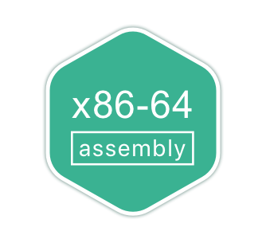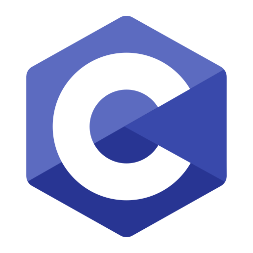 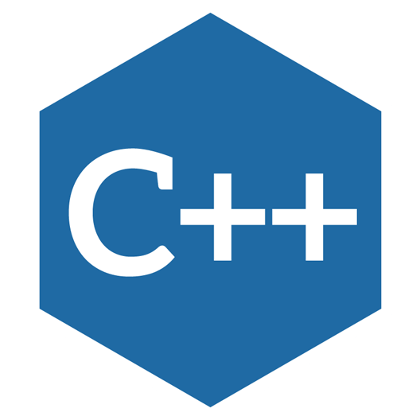 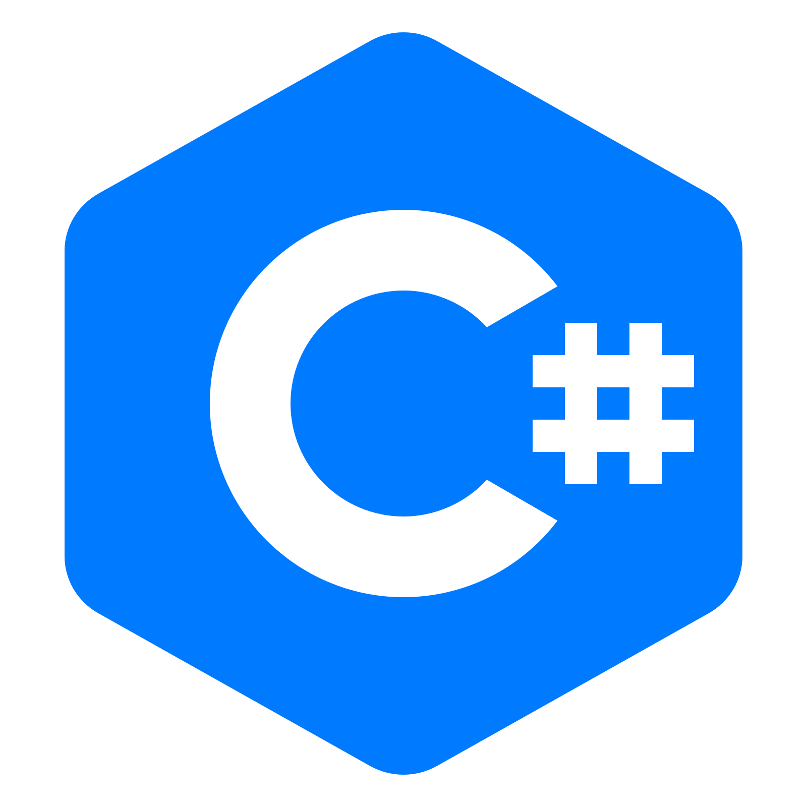 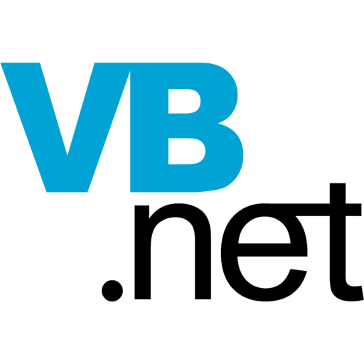 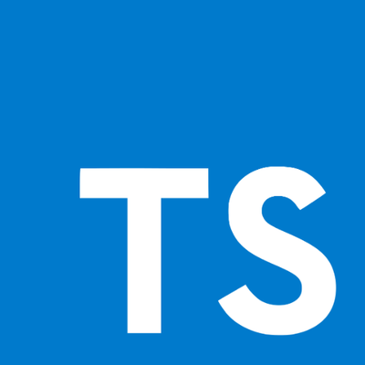 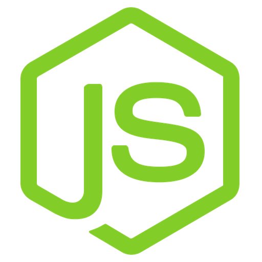 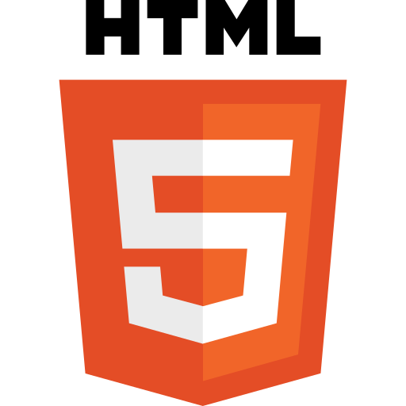 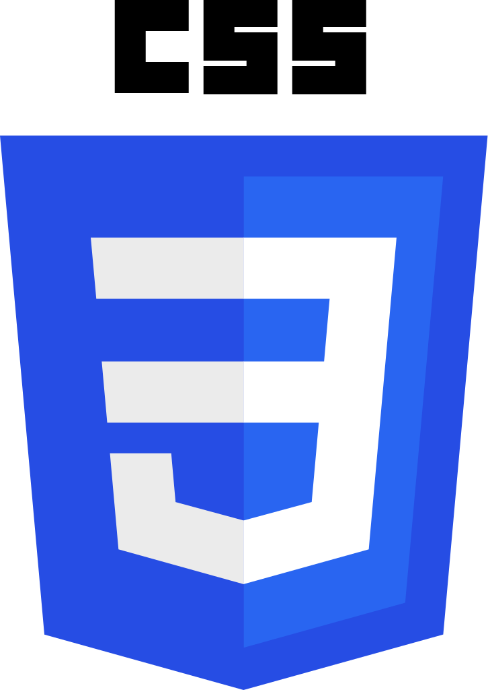 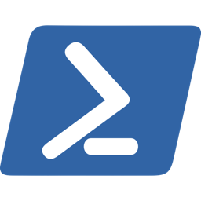  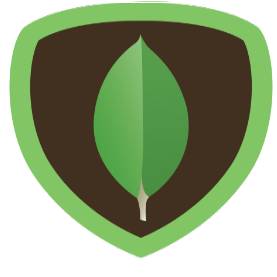 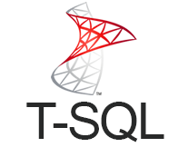 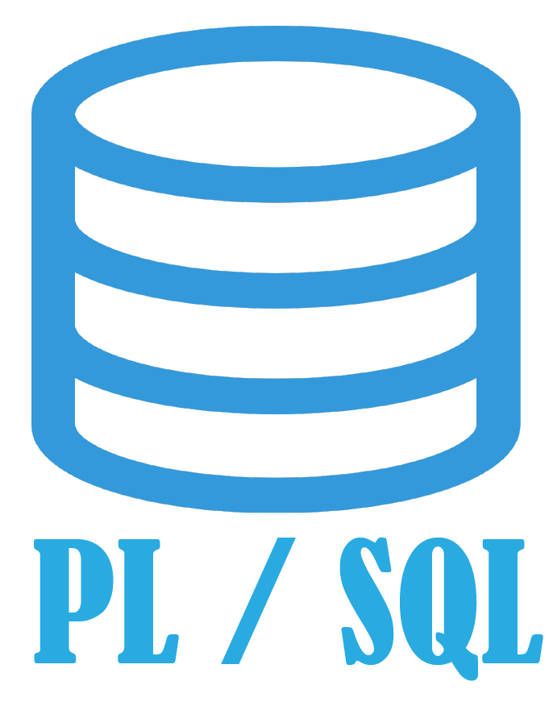 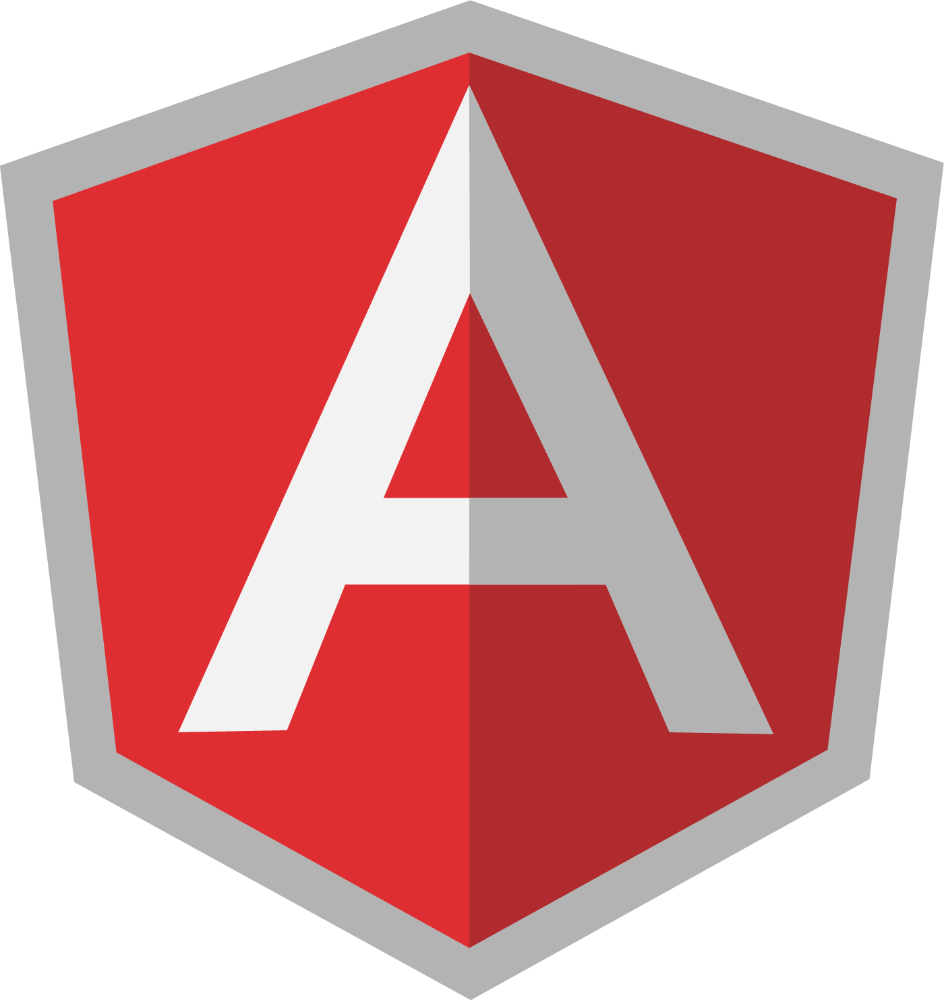  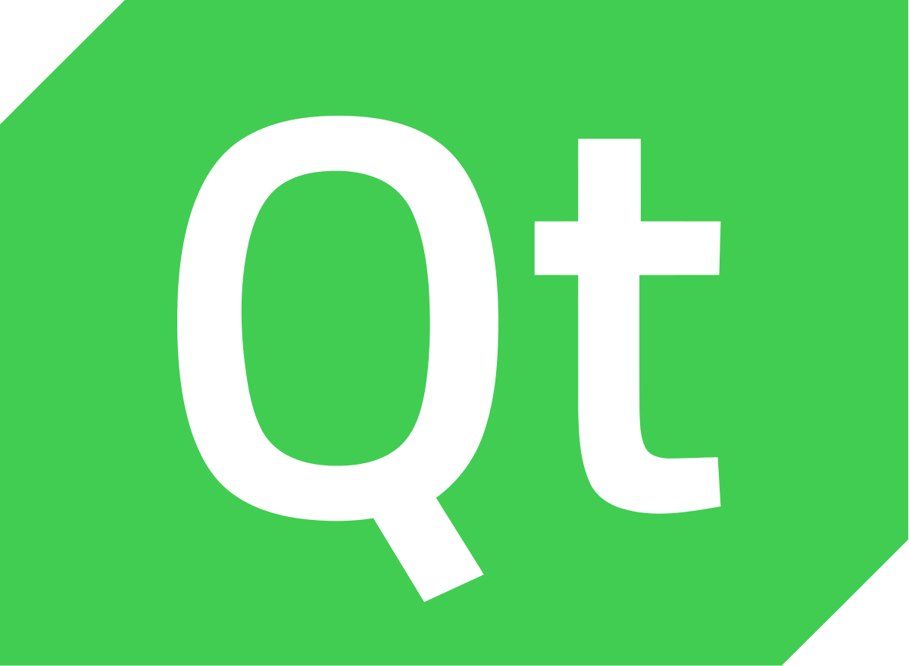 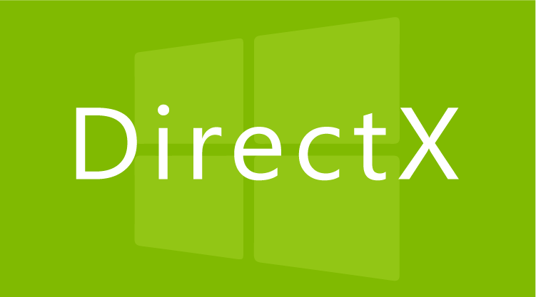 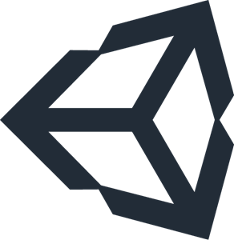

### Short info about me
- [x] Birthday: **19 June 1985**
- [x] City: **Cairo, Egypt**
- [x] Hobbies: **Video Games, Reading**
- [x] Degree: **Bachelor of information technology**
- [x] Website: [imuhamad.com](https://imuhamad.com)
- [x] Email: [me@imuhamad.com](mailto:me@imuhamad.com)
- [x] Languages: **Egyption** (native), Arabic (native), English (you can talk to me!)
- [x] Company: [NoRealm](https://github.com/norealm) in the near future I hope!

### I’m currently working on
 - [x] [Phi Platform](https://github.com/phiplatform): Data access technology for .net
 - [x] [SRP](https://github.com/srpsys): a closed source ERP system in c#.
 - [x] [Wikiless](https://github.com/wikiless): an extensible blog system to be hosted in github. 

### Future projects
 - [ ] [OpenAssault](https://github.com/openassault): a 3rd person shooter video game.
 - [ ] [Open FIFA](https://github.com/openfifa): a football game.
 - [ ] [Open Karting](https://github.com/openkarting): A karting race video game.
 - [ ] [RealmOS](https://github.com/realmos): an operating system kernel.
 - [ ] [RealmTC](https://github.com/realmtc): a tool chain for extensible programming language.
